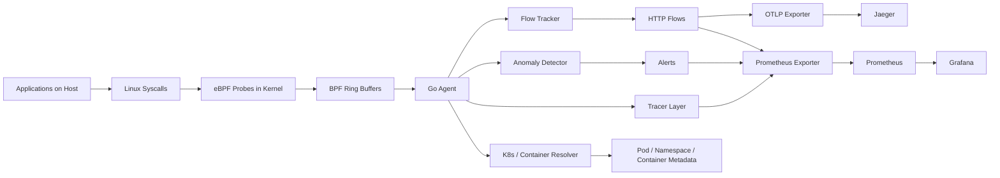
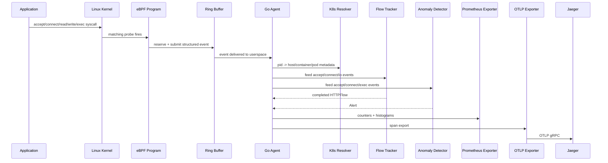
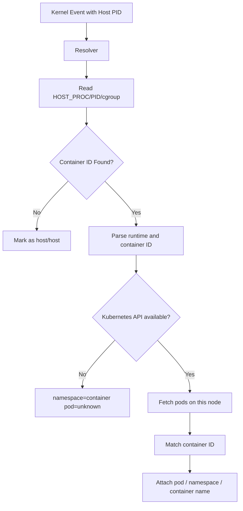

# eBPF Sentinel

Zero-instrumentation observability for Linux hosts using eBPF.

`eBPF Sentinel` watches syscall activity from the kernel, reconstructs HTTP flows, detects suspicious behavior, exports traces to Jaeger over OTLP, and exposes Prometheus metrics without requiring any application code changes, SDKs, or restarts.

This repository is currently built and tested around:

- Linux on `amd64` / `x86_64`
- Fedora Workstation-style host environments
- Kernel support for BTF + ring buffer maps
- privileged execution for eBPF loading

## What This Project Does

At a high level, Sentinel:

1. Attaches eBPF programs to network, process, and IO-related kernel hooks.
2. Streams low-level events to a Go userspace agent through BPF ring buffers.
3. Reconstructs HTTP request/response pairs from raw syscall payloads.
4. Detects anomalous behavior using per-process profiles.
5. Tags activity with host, container, and Kubernetes metadata.
6. Exposes metrics for Prometheus and spans for Jaeger.

## Big Picture



## End-to-End Event Flow



## Repository Layout

```text
ebpf-sentinel/
├── ebpf/
│   ├── common.h
│   ├── accept.bpf.c
│   ├── connect.bpf.c
│   ├── exec.bpf.c
│   ├── write.bpf.c
│   └── vmlinux.h
├── agent/
│   ├── main.go
│   ├── config/
│   ├── tracer/
│   ├── flow/
│   ├── anomaly/
│   ├── export/
│   └── k8s/
├── profiles/
│   └── default.yaml
├── deploy/
│   ├── Dockerfile
│   ├── docker-compose.yml
│   ├── prometheus.yml
│   └── k8s/
├── Makefile
├── go.mod
└── go.sum
```

## Architecture by Layer

### 1. Kernel Probe Layer

Files:

- `ebpf/accept.bpf.c`
- `ebpf/connect.bpf.c`
- `ebpf/exec.bpf.c`
- `ebpf/write.bpf.c`
- `ebpf/common.h`

Responsibilities:

- Hook into selected syscalls / tracepoints
- Extract process, socket, and payload metadata
- Submit compact event structs into ring buffers
- Maintain per-probe drop counters

Current probes:

- `accept4` return probe for inbound connections
- `connect` entry probe for outbound connections
- `sched_process_exec` tracepoint for process execution
- `write`, `sendto`, `read`, and `recvfrom` probes for L7 HTTP reconstruction

### 2. Tracer Layer

Files:

- `agent/tracer/accept.go`
- `agent/tracer/connect.go`
- `agent/tracer/exec.go`
- `agent/tracer/write.go`
- `agent/tracer/helpers.go`
- `agent/tracer/metrics.go`

Responsibilities:

- Load generated eBPF objects
- Attach probes to valid kernel symbols
- Read BPF ring buffers
- Decode binary events into Go structs
- Report probe ring buffer capacity and dropped-event counters

### 3. Flow Reconstruction Layer

Files:

- `agent/flow/types.go`
- `agent/flow/tracker.go`

Responsibilities:

- Track `(pid, fd)` connections
- Observe request bytes from `write` / `sendto`
- Observe response bytes from `read` / `recvfrom`
- Emit completed `HTTPFlow` records
- Enrich flows with remote endpoint and pod/container metadata

Current scope:

- Handles the common case where request/response headers fit into the first captured syscall payload
- Uses TTL-based eviction to avoid unbounded in-memory growth

### 4. Anomaly Detection Layer

Files:

- `agent/anomaly/profiles.go`
- `agent/anomaly/detector.go`
- `profiles/default.yaml`

Responsibilities:

- Load profiles that describe expected behavior per process name
- Emit alerts for:
  - unknown processes doing network activity
  - unexpected outbound destinations
  - unexpected outbound ports
  - privileged port access
  - disallowed exec behavior

### 5. Metadata Enrichment Layer

Files:

- `agent/k8s/resolver.go`

Responsibilities:

- Read host `/proc/<pid>/cgroup`
- Detect container runtime and container ID
- Best-effort resolve pod / namespace / container name via Kubernetes API
- Cache PID and pod lookups

Supported cgroup styles:

- Docker
- containerd
- CRI-O
- podman / libpod-style IDs

### 6. Export Layer

Files:

- `agent/export/prometheus.go`
- `agent/export/otlp.go`

Responsibilities:

- Expose metrics on an HTTP endpoint for Prometheus
- Export completed HTTP flows as OTLP spans
- Add process, network, and Kubernetes metadata to spans and metrics

## Feature Status

Implemented:

- Phase 1: inbound connection tracing
- Phase 2: outbound connect + exec tracing
- Phase 3: HTTP flow reconstruction
- Phase 4: anomaly detection
- Phase 5: Prometheus + OTLP export
- Phase 6: container / Kubernetes metadata enrichment
- Phase 7: Kubernetes deployment manifests

## Requirements

### Runtime Requirements

- Linux host with eBPF support
- kernel with BTF enabled
- ring buffer support (`5.8+` is the practical baseline)
- root or equivalent privilege to load eBPF programs
- mounted `debugfs` and `bpffs`

### Build Requirements

- Go
- `clang`
- `llvm`
- `gcc`
- `make`
- `pkg-config`
- `libbpf` development headers

### Fedora Setup

Typical Fedora packages:

```bash
sudo dnf install -y \
  clang \
  llvm \
  gcc \
  make \
  pkgconf-pkg-config \
  libbpf-devel \
  golang \
  docker
```

Optional but useful:

```bash
sudo dnf install -y bpftool
```

Make sure the required filesystems are mounted:

```bash
mount | grep debugfs
mount | grep /sys/fs/bpf
```

## Quick Start

### 1. Build

```bash
make build
```

### 2. Run on the Host

```bash
sudo ./bin/sentinel
```

### 3. Generate Some Traffic

In a second terminal:

```bash
python3 -m http.server 18086 --bind 127.0.0.1
```

In a third terminal:

```bash
curl -sS http://127.0.0.1:18086 >/dev/null
```

### 4. Expected Output

You should see a mix of lines like:

```text
[ACCEPT]  pid=... comm=python3 fd=... remote=127.0.0.1:...
[CONNECT] pid=... comm=curl fd=... remote=127.0.0.1:18086
[FLOW]    pid=... comm=curl fd=... GET / status=200 duration=1ms
[ALERT]   type=unknown_process pid=... comm=curl ...
[EXEC]    pid=... ppid=... comm=...
```

## Build and Run Commands

```bash
make generate
make build
make run
make clean
```

What each does:

- `make generate`: regenerates Go bindings from BPF C programs
- `make build`: generates bindings and builds `bin/sentinel`
- `make run`: builds and runs as root
- `make clean`: removes generated objects and binaries

## Configuration

Sentinel reads configuration from defaults, an optional config file, and environment variables.

Important environment variables:

| Variable | Purpose | Default |
|---|---|---|
| `SENTINEL_PROFILE_PATH` | anomaly profile file | `profiles/default.yaml` |
| `PROMETHEUS_PORT` | Prometheus listen port/address | `9090` |
| `OTEL_EXPORTER_OTLP_ENDPOINT` | OTLP endpoint for spans | empty / disabled |
| `OTEL_SERVICE_NAME` | service name used in OTLP spans | `ebpf-sentinel` |
| `HOST_PROC` | host proc root for pid/cgroup lookup | `/proc` |
| `NODE_NAME` | Kubernetes node name for pod filtering | empty |
| `SENTINEL_CONFIG_FILE` | optional `KEY=VALUE` config file | empty |

## Prometheus Metrics

Current metrics:

- `sentinel_accepted_connections_total{comm,namespace,pod}`
- `sentinel_http_requests_total{comm,method,status,path,namespace,pod}`
- `sentinel_http_duration_seconds{comm,method,path,namespace,pod}`
- `sentinel_anomalies_total{comm,type,namespace,pod}`
- `sentinel_events_dropped_total{probe}`
- `sentinel_ringbuf_capacity_bytes{probe}`

Example scrape:

```bash
curl -sS http://127.0.0.1:9090/metrics | rg '^sentinel_'
```

## OTLP / Jaeger

To send spans to Jaeger:

```bash
docker run --rm --name jaeger \
  -p 16686:16686 \
  -p 4317:4317 \
  jaegertracing/all-in-one:latest
```

Then run:

```bash
sudo env OTEL_EXPORTER_OTLP_ENDPOINT=http://127.0.0.1:4317 ./bin/sentinel
```

Useful checks:

```bash
curl -sS http://127.0.0.1:16686/api/services
curl -sS http://127.0.0.1:16686/api/services/ebpf-sentinel/operations
```

Note:

- In local testing, service and operation registration in Jaeger were confirmed.
- Some Jaeger all-in-one API trace-list queries may lag or behave inconsistently even when spans are clearly being received.
- If that happens, use the Jaeger UI on `http://127.0.0.1:16686` to inspect traces interactively.

## Docker Compose

Start the local stack:

```bash
docker compose -f deploy/docker-compose.yml up --build
```

What you get:

- Sentinel
- Jaeger UI on `16686`
- Prometheus on `9091`
- Grafana on `3000`

Important details:

- Sentinel runs with `pid: host`
- Sentinel runs with `network_mode: host`
- Host `/proc` is mounted at `/host/proc`
- profile YAML is mounted read-only into the container

## Running the Packaged Image Manually

Build:

```bash
docker build -f deploy/Dockerfile -t ebpf-sentinel:e2e .
```

Run:

```bash
docker run --rm \
  --name ebpf-sentinel \
  --privileged \
  --pid host \
  --network host \
  -v /proc:/host/proc:ro \
  -v /sys/kernel/debug:/sys/kernel/debug \
  -v /sys/fs/bpf:/sys/fs/bpf \
  -v "$(pwd)/profiles:/etc/sentinel/profiles:ro" \
  -e OTEL_EXPORTER_OTLP_ENDPOINT=http://127.0.0.1:4317 \
  ebpf-sentinel:e2e
```

## Kubernetes Deployment

Files:

- `deploy/k8s/rbac.yaml`
- `deploy/k8s/configmap.yaml`
- `deploy/k8s/daemonset.yaml`

Apply order:

```bash
kubectl apply -f deploy/k8s/rbac.yaml
kubectl apply -f deploy/k8s/configmap.yaml
kubectl apply -f deploy/k8s/daemonset.yaml
```

What the DaemonSet does:

- runs one privileged Sentinel pod per node
- uses `hostPID: true`
- uses `hostNetwork: true`
- mounts host `/proc` at `/host/proc`
- mounts `debugfs` and `bpffs`
- injects `NODE_NAME`
- mounts profiles from a ConfigMap

Important Kubernetes notes:

- the namespace is labeled for privileged Pod Security admission
- the ServiceAccount can `get`, `list`, and `watch` pods
- the resolver filters pod lookups by node when `NODE_NAME` is provided
- update the image in `deploy/k8s/daemonset.yaml` to your pushed image before deployment

To inspect the rollout:

```bash
kubectl -n ebpf-sentinel get pods
kubectl -n ebpf-sentinel logs -l app.kubernetes.io/name=ebpf-sentinel
```

## How Metadata Resolution Works



## Profiles and Alerting

Profiles live in:

- `profiles/default.yaml`

They match on the kernel `comm` field, which is truncated to 15 visible characters.

Example behavior:

- `nginx` can be restricted to internal subnets
- `node` can be restricted to expected ports such as `5432`, `6379`, `8080`
- `postgres` can be kept local to `127.0.0.1/32`

If a process is not in the profile set and makes network syscalls, Sentinel emits `unknown_process`.

## Troubleshooting

### `permission denied` while loading BPF programs

Make sure you are:

- running as root
- running on a supported kernel
- using a privileged container when inside Docker / Kubernetes
- mounting `/sys/kernel/debug` and `/sys/fs/bpf`

### Metrics endpoint is empty or unreachable

Check:

```bash
curl -sS http://127.0.0.1:9090/metrics | head
```

If Sentinel is running inside a container, remember that host networking and port binding matter.

### You only see `unknown_process` alerts

That usually means:

- the process has no profile yet
- the profile name does not match the kernel-truncated `comm`

### Jaeger shows the service but not traces

Try:

- checking the Jaeger UI directly
- waiting a few seconds for batch flush
- confirming `OTEL_EXPORTER_OTLP_ENDPOINT`
- checking Jaeger logs for OTLP receiver activity

### Kernel verifier errors

These usually come from:

- unbounded pointer reads
- signed/unsigned length issues
- stack growth
- missing null checks

When changing BPF code, test both:

- host build + local run
- container image build + packaged run

The second path may surface verifier issues that the first path does not.

## Security and Operational Notes

- Sentinel is intentionally privileged because it loads kernel BPF programs and reads host process metadata.
- Treat this as infrastructure software, not a normal unprivileged app container.
- Review where metrics and traces are shipped before enabling in production.

## Suggested Operator Workflow

For a first local run:

1. `make build`
2. `sudo ./bin/sentinel`
3. generate local traffic with `python3 -m http.server` and `curl`
4. confirm terminal output
5. scrape `:9090/metrics`
6. optionally start Jaeger and enable `OTEL_EXPORTER_OTLP_ENDPOINT`

For a cluster rollout:

1. build and push your image
2. update `deploy/k8s/daemonset.yaml`
3. apply RBAC
4. apply ConfigMap
5. apply DaemonSet
6. inspect pod logs and metrics

## Tested Flows

The repository has been exercised end to end for:

- host build and run
- live inbound and outbound traffic capture
- HTTP flow reconstruction
- Prometheus metrics export
- Jaeger service / operation registration via OTLP
- packaged Docker image build
- packaged privileged container run with host mounts

## Limitations

- current BPF build target is `amd64`
- HTTP reconstruction handles the common case, not full multi-syscall reassembly
- pod resolution depends on in-cluster Kubernetes API availability
- default anomaly profiles are intentionally minimal and will alert on many real host processes

## License

See the repository license if one is added later. Until then, treat this as project source under the repository’s current terms and commit history.
